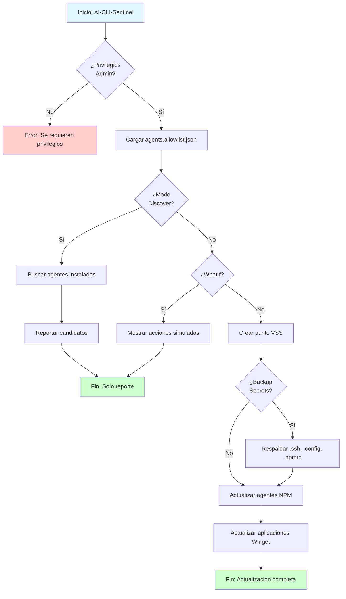

# AI-CLI-Sentinel

[](https://github.com/datanicaragua/ai-cli-sentinel/actions)

Sistema de seguridad para monitoreo y protección de interfaces de línea de comandos con capacidades de IA.

## 🚀 Características

- **Gestión de seguridad** para la cadena de suministro de IA
- **Lista blanca estricta** de agentes permitidos (NPM y Winget)
- **Modo descubrimiento** para auditoría de agentes instalados
- **Puntos de restauración VSS** antes de actualizaciones
- **Respaldo automático** de secretos (.ssh, .config, .npmrc)
- **Mitigaciones de seguridad** con `--ignore-scripts` para prevenir malware
- **Logging completo** para auditoría y análisis

## 📋 Requisitos

- PowerShell 5.1 o superior (recomendado: PowerShell 7.4+)
- Windows 10/11 o Windows Server 2016+
- **Privilegios de Administrador** (requeridos para VSS y actualizaciones globales)
- Node.js y npm instalados (para gestión de paquetes NPM)
- Winget instalado (para gestión de aplicaciones Windows)

## 🔧 Instalación

### Instalación Rápida

```powershell
# Clonar el repositorio
git clone https://github.com/datanicaragua/ai-cli-sentinel.git
cd ai-cli-sentinel

# Verificar estructura
Get-ChildItem -Recurse
```

### Configuración Inicial

1. **Revisar configuración:**
   ```powershell
   Get-Content src\agents.allowlist.json
   ```

2. **Personalizar lista de permitidos:**
   Edita `src\agents.allowlist.json` para agregar tus agentes permitidos en los arrays `npm` y `winget`.

3. **Verificar permisos:**
   ```powershell
   Get-ExecutionPolicy
   # Si es necesario: Set-ExecutionPolicy RemoteSigned -Scope CurrentUser
   ```

## 📖 Uso

### Ejecución Estándar (Modo Seguro)

Actualiza solo los agentes en la lista blanca con respaldo de secretos:

```powershell
# Ejecutar como Administrador
.\src\AI-CLI-Sentinel.ps1 -BackupSecrets
```

### Modo Simulación (WhatIf)

Ver qué haría el script sin realizar cambios:

```powershell
.\src\AI-CLI-Sentinel.ps1 -WhatIf
```

### Modo Descubrimiento (Auditoría)

Buscar agentes de IA instalados que NO están en la lista blanca:

```powershell
.\src\AI-CLI-Sentinel.ps1 -Discover
```

Este modo **NO realiza cambios**, solo reporta candidatos detectados.

### Personalizar Archivo de Configuración

```powershell
.\src\AI-CLI-Sentinel.ps1 -ConfigFile "ruta\personalizada\agents.allowlist.json" -BackupSecrets
```

### Personalizar Ruta de Logs

```powershell
.\src\AI-CLI-Sentinel.ps1 -LogPath "C:\Logs\sentinel.log" -BackupSecrets
```

## 📁 Estructura del Proyecto

```
ai-cli-sentinel/
├── .github/
│   ├── workflows/
│   │   └── ci-lint.yml           # CI: Validación automática
│   └── ISSUE_TEMPLATE/
│       ├── bug_report.md
│       ├── feature_request.md
│       └── security_report.md
├── src/
│   ├── AI-CLI-Sentinel.ps1       # Script principal
│   └── agents.allowlist.json     # Configuración
├── tests/
│   └── AI-CLI-Sentinel.tests.ps1 # Pruebas unitarias
├── docs/
│   ├── architecture.md           # Arquitectura del sistema
│   └── recovery.md               # Guía de recuperación
├── .gitignore
├── CONTRIBUTING.md
├── LICENSE
├── README.md
└── SECURITY.md
```

## 🔄 Flujo de Ejecución



## 🧪 Testing

Ejecutar tests con Pester:

```powershell
# Instalar Pester si es necesario
Install-Module -Name Pester -Force -SkipPublisherCheck

# Ejecutar tests
Invoke-Pester tests/
```

## 🔒 Seguridad

Para reportar vulnerabilidades de seguridad, por favor usa el [formulario de seguridad](.github/ISSUE_TEMPLATE/security_report.md) o consulta [SECURITY.md](SECURITY.md).

## 🤝 Contribuir

Las contribuciones son bienvenidas! Por favor lee [CONTRIBUTING.md](CONTRIBUTING.md) para más detalles sobre cómo contribuir al proyecto.

## 📄 Licencia

Este proyecto está licenciado bajo la Licencia MIT - ver el archivo [LICENSE](LICENSE) para más detalles.

## 👥 Autores

**Gustavo Ernesto Martínez Cárdenas** *Lead Data Scientist & Architect at DataNicaragua*

[](https://github.com/gustavoemc)
[](https://www.linkedin.com/in/gustavoernestom)

---
**DataNicaragua** - [Organización](https://github.com/datanicaragua)

## 🙏 Agradecimientos

Gracias a todos los contribuidores que hacen posible este proyecto.

## 📞 Soporte

- **Issues**: [GitHub Issues](https://github.com/datanicaragua/ai-cli-sentinel/issues)
- **Documentación**: Ver carpeta `docs/`

---

⭐ Si este proyecto te resulta útil, considera darle una estrella en GitHub!
