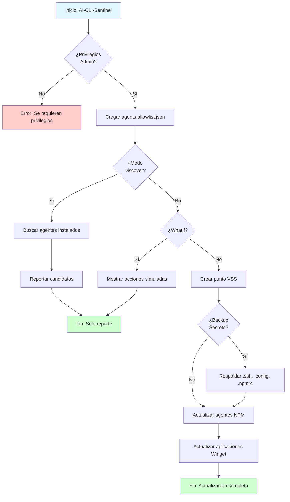

# AI-CLI-Sentinel

[](https://github.com/datanicaragua/ai-cli-sentinel/actions)

Sistema de seguridad para monitoreo y protección de interfaces de línea de comandos con capacidades de IA.

## ¿Por qué necesito AI-CLI-Sentinel?

Si usas herramientas de inteligencia artificial en tu terminal (como **Gemini**, **Claude**, **Codex** o **GitHub Copilot**), necesitas mantenerlas actualizadas para obtener las últimas mejoras. Sin embargo, actualizar software desde internet puede ser riesgoso. **AI-CLI-Sentinel** es tu "cinturón de seguridad": automatiza la actualización de tus agentes favoritos asegurándose de que, si algo sale mal o el paquete contiene errores, tu computadora y tus llaves de acceso (API Keys) estén protegidas.

### ✅ Checklist de Confianza

**¿Qué hace este script por mí?**

* ✅ **No toca tus archivos personales:** Solo respalda configuraciones de IA.
* ✅ **Es reversible:** Crea un punto de restauración para que puedas "volver atrás".
* ✅ **Es silencioso:** Hace el trabajo pesado en segundos sin pedirte configuraciones complejas.
* ✅ **Solo actualiza lo que tú apruebas:** Trabaja con una lista blanca estricta de agentes confiables.
* ✅ **Protege tus secretos:** Respalda automáticamente tus llaves de acceso antes de cualquier cambio.

## 🤖 Agentes Soportados

AI-CLI-Sentinel gestiona de forma segura los siguientes agentes de IA:

| Agente | Desarrollador | Propósito |
| --- | --- | --- |
| **Gemini CLI** | Google | Asistente multimodal y generación de código. |
| **Claude Code** | Anthropic | Programación en pareja (Pair programming) avanzada. |
| **Codex CLI** | OpenAI | Generación de comandos y lógica de programación. |
| **Qwen Code** | Alibaba | Modelos de lenguaje especializados en código. |
| **GitHub Copilot CLI** | GitHub | Asistencia de IA para comandos y flujos en terminal. |

> **Nota:** Puedes agregar más agentes editando el archivo `src/agents.allowlist.json`. Solo se actualizarán los agentes que estén explícitamente en tu lista blanca.

## 🚀 Características

- **Seguridad primero:** Solo actualiza agentes que tú explícitamente apruebas en tu lista blanca
- **Protección automática:** Crea puntos de restauración antes de cualquier cambio
- **Respaldo de secretos:** Guarda automáticamente tus llaves de acceso antes de actualizar
- **Modo descubrimiento:** Encuentra agentes instalados que no están en tu lista blanca (sin hacer cambios)
- **Prevención de malware:** Usa técnicas avanzadas para evitar la ejecución de código malicioso durante instalaciones
- **Registro completo:** Mantiene un log detallado de todas las operaciones para tu revisión

## 📋 Requisitos

- PowerShell 5.1 o superior (recomendado: PowerShell 7.4+)
- Windows 10/11 o Windows Server 2016+
- **Privilegios de Administrador** (requeridos para VSS y actualizaciones globales)
- Node.js y npm instalados (para gestión de paquetes NPM)
- Winget instalado (para gestión de aplicaciones Windows)

## 🔧 Instalación

### Instalación Rápida

```powershell
# Clonar el repositorio
git clone https://github.com/datanicaragua/ai-cli-sentinel.git
cd ai-cli-sentinel

# Verificar estructura
Get-ChildItem -Recurse
```

### Configuración Inicial

1. **Revisar configuración:**
   ```powershell
   Get-Content src\agents.allowlist.json
   ```

2. **Personalizar lista de permitidos:**
   Edita `src\agents.allowlist.json` para agregar tus agentes permitidos en los arrays `npm` y `winget`.

3. **Verificar permisos:**
   ```powershell
   Get-ExecutionPolicy
   # Si es necesario: Set-ExecutionPolicy RemoteSigned -Scope CurrentUser
   ```

## 📖 Uso

### Ejecución Estándar (Modo Seguro)

Actualiza solo los agentes en la lista blanca con respaldo de secretos:

```powershell
# Ejecutar como Administrador
.\src\AI-CLI-Sentinel.ps1 -BackupSecrets
```

Comportamiento de salida:
- Devuelve `0` cuando todas las operaciones completan sin fallos.
- Devuelve `1` si una o más actualizaciones fallan (útil para automatización/CI).

### Modo Simulación (WhatIf)

Ver qué haría el script sin realizar cambios:

```powershell
.\src\AI-CLI-Sentinel.ps1 -WhatIf
```

### Modo Descubrimiento (Auditoría)

Buscar agentes de IA instalados que NO están en la lista blanca:

```powershell
.\src\AI-CLI-Sentinel.ps1 -Discover
```

Este modo **NO realiza cambios** de actualización. Exporta candidatos detectados en `src\agents.candidates.json` para revisión.

### Aprobar Candidatos Detectados (Paso Explícito)

Revisar candidatos y decidir si se agregan a la lista blanca:

```powershell
.\src\AI-CLI-Sentinel.ps1 -ApproveCandidates
```

Modo no interactivo (aprobación de todos los pendientes):

```powershell
.\src\AI-CLI-Sentinel.ps1 -ApproveCandidates -AutoApproveCandidates
```

Este modo **solo actualiza la allowlist**. Luego ejecuta el flujo estándar para actualizar paquetes.

## 📘 Guía Rápida para Usuarios No Técnicos

### ¿Qué hace AI-CLI-Sentinel?

Imagina que tienes varios asistentes de IA instalados en tu computadora (como Gemini, Claude, Codex). Cada cierto tiempo, estos asistentes reciben actualizaciones con nuevas funciones y correcciones de errores. AI-CLI-Sentinel es como un asistente personal que:

1. **Verifica qué asistentes tienes instalados** (modo Discover)
2. **Actualiza solo los que tú apruebas** (lista blanca)
3. **Crea una copia de seguridad** antes de hacer cambios (punto de restauración)
4. **Protege tus llaves de acceso** (respaldo de secretos)

### Línea de Tiempo del Proceso

```
┌─────────────────────────────────────────────────────────────┐
│ 1. Inicio: Verificas que tienes permisos de administrador  │
└─────────────────────────────────────────────────────────────┘
                          ↓
┌─────────────────────────────────────────────────────────────┐
│ 2. Preparación: Se crea un punto de restauración del sistema│
│    (por si necesitas "volver atrás")                        │
└─────────────────────────────────────────────────────────────┘
                          ↓
┌─────────────────────────────────────────────────────────────┐
│ 3. Respaldo: Se guardan tus llaves de acceso (.ssh, .config)│
└─────────────────────────────────────────────────────────────┘
                          ↓
┌─────────────────────────────────────────────────────────────┐
│ 4. Actualización: Se actualizan solo los agentes aprobados  │
│    en tu lista blanca                                       │
└─────────────────────────────────────────────────────────────┘
                          ↓
┌─────────────────────────────────────────────────────────────┐
│ 5. Finalización: Todo listo. Tus agentes están actualizados  │
│    y protegidos                                              │
└─────────────────────────────────────────────────────────────┘
```

### Modo Simulación (Recomendado para Primera Vez)

Antes de ejecutar el script por primera vez, usa el modo simulación para ver qué haría sin hacer cambios reales:

```powershell
.\src\AI-CLI-Sentinel.ps1 -WhatIf
```

Verás mensajes como:
- `What if: Performing the operation 'Crear Punto de Restauración (VSS)'...`
- `What if: Performing the operation 'Actualizar NPM'...`

Esto te permite entender exactamente qué hará el script antes de ejecutarlo realmente.

### Personalizar Archivo de Configuración

```powershell
.\src\AI-CLI-Sentinel.ps1 -ConfigFile "ruta\personalizada\agents.allowlist.json" -BackupSecrets
```

### Personalizar Ruta de Logs

```powershell
.\src\AI-CLI-Sentinel.ps1 -LogPath "C:\Logs\sentinel.log" -BackupSecrets
```

## 📁 Estructura del Proyecto

```
ai-cli-sentinel/
├── .github/
│   ├── workflows/
│   │   └── ci-lint.yml           # CI: Validación automática
│   └── ISSUE_TEMPLATE/
│       ├── bug_report.md
│       ├── feature_request.md
│       └── security_report.md
├── src/
│   ├── AI-CLI-Sentinel.ps1       # Script principal
│   └── agents.allowlist.json     # Configuración
├── tests/
│   └── AI-CLI-Sentinel.tests.ps1 # Pruebas unitarias
├── docs/
│   ├── architecture.md           # Arquitectura del sistema
│   └── recovery.md               # Guía de recuperación
├── .gitignore
├── CONTRIBUTING.md
├── LICENSE
├── README.md
└── SECURITY.md
```

## 🔄 Flujo de Ejecución



## 🧪 Testing

Ejecutar tests con Pester:

```powershell
# Instalar Pester si es necesario
Install-Module -Name Pester -Force -SkipPublisherCheck

# Ejecutar tests
Invoke-Pester tests/
```

## 🔒 Seguridad

Para reportar vulnerabilidades de seguridad, por favor usa el [formulario de seguridad](.github/ISSUE_TEMPLATE/security_report.md) o consulta [SECURITY.md](SECURITY.md).

### Referencias de Seguridad

Este proyecto implementa prácticas de seguridad basadas en estándares reconocidos:

1. **OWASP Top 10 para LLM (2024-2025)**
   - Mitiga riesgos de "Insecure Output Handling" mediante validación estricta de entrada.
   - Previene ataques de inyección indirecta mediante lista blanca de agentes.
   - Referencia: [OWASP LLM Top 10](https://owasp.org/www-project-top-10-for-large-language-model-applications/)

2. **Node.js Security Best Practices**
   - Utiliza `--ignore-scripts` para prevenir la ejecución de malware durante la instalación de paquetes npm.
   - Referencia: [npm Security Best Practices](https://docs.npmjs.com/cli/v9/using-npm/scripts#security)

3. **Microsoft Volume Shadow Copy Service (VSS)**
   - Implementa puntos de restauración del sistema antes de realizar cambios críticos.
   - Referencia: [Windows System Restore](https://learn.microsoft.com/en-us/windows/win32/vss/volume-shadow-copy-service-overview)

4. **Repositorios Oficiales**
   - Solo interactúa con repositorios oficiales y verificados:
     - [npm Registry](https://www.npmjs.com/) - Para paquetes Node.js
     - [Microsoft Winget](https://github.com/microsoft/winget-cli) - Para aplicaciones Windows
     - [OpenAI Codex](https://developers.openai.com/codex/) - Documentación oficial de Codex CLI
     - [Qwen Code](https://github.com/QwenLM/qwen-code) - Repositorio oficial de Qwen Code

## 🤝 Contribuir

Las contribuciones son bienvenidas! Por favor lee [CONTRIBUTING.md](CONTRIBUTING.md) para más detalles sobre cómo contribuir al proyecto.

## 📄 Licencia

Este proyecto está licenciado bajo la Licencia MIT - ver el archivo [LICENSE](LICENSE) para más detalles.

## 👥 Autores

**Gustavo Ernesto Martínez Cárdenas** *Lead Data Scientist & Architect at DataNicaragua*

[](https://github.com/gustavoemc)
[](https://www.linkedin.com/in/gustavoernestom)

---
**DataNicaragua** - [Organización](https://github.com/datanicaragua)

## 🙏 Agradecimientos

Gracias a todos los contribuidores que hacen posible este proyecto.

## 📞 Soporte

- **Issues**: [GitHub Issues](https://github.com/datanicaragua/ai-cli-sentinel/issues)
- **Documentación**: Ver carpeta `docs/`

---

⭐ Si este proyecto te resulta útil, considera darle una estrella en GitHub!
